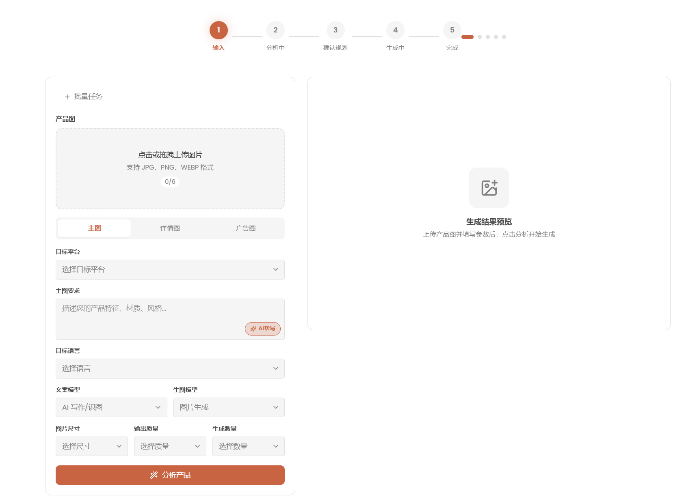

# PixMart AI

AI 驱动的电商图片设计工作站 —— 上传产品图，一键生成商品详情图、广告图与风格复刻图。

> **项目状态：开发完善中** —— 软件仍在持续迭代，功能与界面会陆续优化，欢迎反馈建议与问题。



## 功能特性

- **商品图生成**：基于产品图与描述，生成多方案电商图片
- **风格复刻**：参考设计图，将目标风格应用到产品主体（保持产品外观不变）
- **多方案规划**：AI 分析产出多套设计方案，确认后批量生成
- **批量任务**：多商品、多方案批量生成
- **模型配置**：支持官方厂商（OpenAI / Anthropic / Google AI / Agnes AI）与聚合中转（Ofox / OpenRouter / 自定义）
  - 自定义接入支持 **OpenAI / Anthropic / Gemini** 三协议
  - Ofox 的 Gemini 图像模型走原生协议，支持图生图、保持主体一致性
- **项目管理**：项目记录、图片预览、打开目录、删除、批量选择
- **主题**：深色 / 浅色主题

## 技术栈

- Electron 35 + electron-vite
- React 18 + TypeScript
- Tailwind CSS + lucide-react
- zustand 状态管理
- sql.js（本地 SQLite 存储）
- OpenAI SDK / Anthropic SDK

## 开发

```bash
npm install
npm run dev
```

数据存储于系统用户数据目录：
- Windows：`%APPDATA%/pixmart-ai`
- macOS：`~/Library/Application Support/pixmart-ai`

## 打包

```bash
# Windows（需在 Windows 上执行）
npm run build:win

# macOS（需在 macOS 上执行）
npm run build:mac
```

产物输出到 `dist/` 目录（Windows: NSIS 安装包；macOS: dmg + zip，含 arm64/x64）。

> macOS 未签名包首次打开需右键 → 打开。正式分发请配置代码签名证书（移除 `electron-builder.yml` 中的 `identity: null`）。

## 模型接入

在「设置 → 模型管理」中添加厂商并配置 API Key：

| 类型 | 厂商 | 说明 |
|---|---|---|
| 官方 | OpenAI / Anthropic / Google AI / Agnes AI | 各家官方 API |
| 聚合 | Ofox / OpenRouter / 自定义 | 统一 Key 接入多模型 |
| 自定义 | 三协议可选 | OpenAI / Anthropic / Gemini 兼容端点 |

## License

[MIT](./LICENSE)
